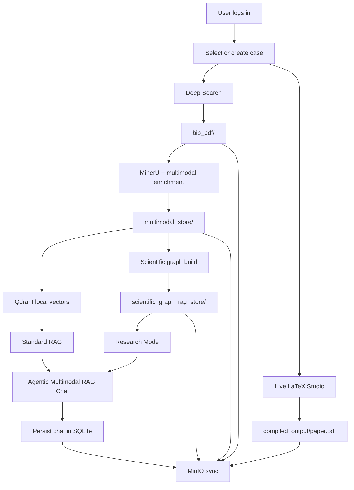
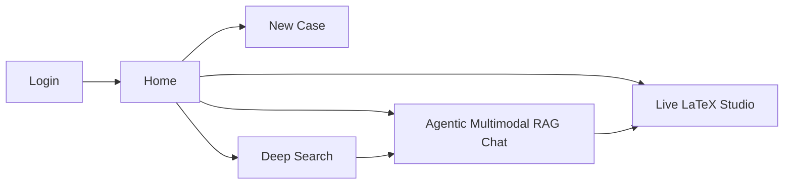
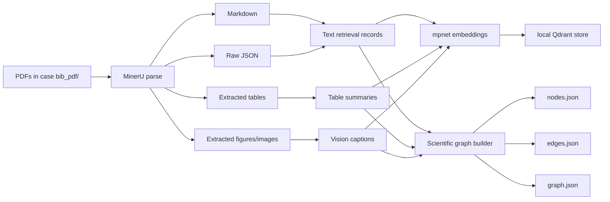
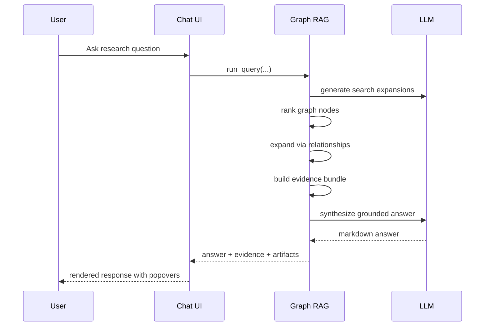

# DeepSciPaper


DeepSciPaper is a case-based scientific research workspace for:

- agentic deep literature search
- multimodal PDF parsing and indexing
- graph-backed and vector-backed RAG
- evidence-grounded chat
- LaTeX co-authoring and local compilation
- case persistence with SQLite
- artifact backup to MinIO

The app is built around one idea: a study should be reproducible, inspectable, and portable. Every case keeps its own PDFs, multimodal store, graph store, compiled outputs, and chat history.


### Demo 1
<p align="center">
  
</p>


## Current Product Surface

DeepSciPaper now includes:

- login screen with demo credentials
- home page with case overview
- case creation and switching
- Deep Search workspace
- Agentic Multimodal RAG Chat workspace
- Live LaTeX Studio
- SQLite-backed app state
- optional MinIO artifact sync

The app is case-first: every workflow runs inside the active study, and a successful indexing run now finishes by building both the multimodal vector store and the graph-RAG artifacts needed for Research Mode.

Default login:

- username: `admin`
- password: `admin`

## Case-Based Workspace Layout

Each case lives under:

```text
cases/<case-slug>/
├── bib_pdf/
├── multimodal_store/
├── scientific_graph_rag_store/
├── compiled_output/
└── paper.tex
```

This means one study does not contaminate another. The active case controls what Deep Search, indexing, chat, and LaTeX work against.

## High-Level Architecture



## Application Navigation



## Deep Search Workflow

The Deep Search tab is intentionally narrow now:

- deep search query
- report type
- research-plan generation
- plan editing
- approved research execution
- final report reading
- source explorer

The deep-search engine is local `gpt-researcher`, vendored in:

```text
engines/gpt-researcher/
```

When a search completes, the app:

1. saves the report into the active case `bib_pdf/`
2. validates discovered links
3. downloads reachable PDFs when available
4. keeps the report readable in-app
5. offers a button to jump directly to indexing/chat

## Multimodal Indexing Workflow

The indexing controls live in the **Agentic Multimodal RAG Chat** tab because that is where users actually need workspace readiness.

When you click **Index**, the app now performs:

1. MinerU parsing
2. multimodal artifact extraction
3. table summarization
4. figure/image captioning
5. mpnet embedding creation
6. Qdrant indexing
7. automatic scientific graph creation

So indexing no longer stops at the multimodal store. At the end of a successful run, the case is ready for:

- Standard RAG
- Research Mode

### Index-Time Artifact Flow




The standard multimodal RAG path is still the fast lane in the product: it retrieves grounded evidence from the indexed multimodal store first, then synthesizes with the currently selected cloud or Ollama model.

## Two RAG Modes

The chat tab has two retrieval modes:

### 1. Standard RAG

Standard RAG is the faster path.

It uses:

- `multimodal_store/`
- Qdrant retrieval
- evidence bundle assembly
- synthesis with the active UI-selected model

Best for:

- quick grounded answers
- scanning evidence fast
- iterative questioning

### 2. Research Mode

Research Mode is the deeper path.

It uses:

- `scientific_graph_rag_store/`
- multi-query expansion
- graph node ranking
- relationship expansion
- evidence aggregation across node links
- synthesis with the active UI-selected model

Best for:

- section-aware reasoning
- table/figure/text linkage
- more structured research answers
- higher interpretability

Both modes render through the same answer surface:

- markdown answer body
- evidence popovers
- local PDF previews
- table/image artifact previews
- downloadable source files

## How Graph RAG Works

Each indexed paper gets an independent knowledge graph.

### Node Types

- paper root
- section/text node
- table node
- figure node

### Stored Context

Each node contains:

- global paper context
- local section context
- previous node
- next node
- related node links
- artifact path when relevant

### Relationships

The graph builder creates:

- `contains`
- `next`
- `previous`
- `same_section`
- `references_table`
- `references_figure`
- `contextual_neighbor`
- `semantic_similarity`

### Graph Query Path



## Evidence Display

Evidence is meant to be inspectable, not decorative.

The app now supports:

- evidence popovers from chat answers
- evidence popovers from deep-search reports
- local PDF preview
- figure preview when an asset path points to an image
- download button for the underlying PDF
- source links in the report explorer

## LaTeX Studio

The LaTeX studio now behaves like a real writing surface:

- AI edit controls at the top
- compile button directly under the AI edit action
- source editor on the left
- scrollable PDF preview on the right
- downloadable compiled PDF
- compile logs below the preview
- AI-edited LaTeX is validated before it is written back to `paper.tex`

This is case-scoped, so each case has its own `paper.tex` and compiled PDF.

## SQLite Persistence

SQLite stores:

- cases
- chat history
- sync history

Database default:

```text
app_state/research_copilot.db
```

## MinIO Sync

If configured, MinIO sync uploads:

- `bib_pdf/`
- `multimodal_store/`
- `scientific_graph_rag_store/`
- `compiled_output/`
- `paper.tex`
- exported case metadata
- exported chat history

This makes a study portable beyond the local machine.

## Installation

### 1. Create environment

```bash
conda create -n research_copilot python=3.11 -y
conda activate research_copilot
```

### 2. Install Python dependencies

```bash
python -m pip install -r requirements.txt
```

### 3. Install LaTeX system packages

For Debian/Ubuntu:

```bash
sudo apt update
sudo apt install -y \
  texlive-latex-base \
  texlive-latex-recommended \
  texlive-latex-extra \
  texlive-fonts-recommended \
  texlive-fonts-extra \
  texlive-bibtex-extra \
  texlive-plain-generic \
  texlive-lang-english \
  latexmk \
  dvipng \
  poppler-utils
```

If you want a fuller TeX environment:

```bash
sudo apt install -y texlive-full
```

### 4. Create your environment file

```bash
cp .env.example .env
```

## Important `.env` Settings

Core examples:

```env
OLLAMA_BASE_URL=http://localhost:11434
DEFAULT_MODEL=gemma4:26b

OPENAI_API_KEY=
DEEPSEEK_API_KEY=
TAVILY_API_KEY=

APP_DB_PATH=./app_state/research_copilot.db
SCIENTIFIC_GRAPH_RAG_STORE_DIR=./scientific_graph_rag_store

MINIO_ENDPOINT=
MINIO_ACCESS_KEY=
MINIO_SECRET_KEY=
MINIO_BUCKET=
MINIO_SECURE=false
```

## Run The App

```bash
conda run --no-capture-output -n research_copilot python -m streamlit run app.py --server.address 0.0.0.0 --server.port 8501
```

Open:

```text
http://localhost:8501
```

## Typical End-to-End Usage

### Create a new case

1. log in with `admin` / `admin`
2. go to **New Case**
3. enter case details
4. switch into the new case

### Run Deep Search

1. open **Deep Search & Multimodal Indexing**
2. write the research objective
3. generate a research plan
4. review the planned queries
5. start approved research
6. inspect the final report

### Build retrieval-ready workspace

1. open **Agentic Multimodal RAG Chat**
2. click **Index**
3. wait for:
   - multimodal store creation
   - Qdrant indexing
   - graph-store build
   - chat-ready evidence artifacts
4. ask questions immediately

### Work in chat

- choose `🧠 Standard RAG` for faster answers
- choose `🕸 Research Mode` for graph-backed answers
- inspect evidence popovers
- review PDF and figure artifacts

### Write the paper

1. open **Live LaTeX Studio & Local Compiling**
2. ask AI to update the source
3. compile
4. inspect the PDF preview
5. download the compiled paper

## CLI Examples

### Clean multimodal store

```bash
python multimodal_pipeline.py clean --store ./cases/text_segmentation/multimodal_store
```

### Rebuild multimodal store

```bash
python multimodal_pipeline.py ingest \
  --pdf-dir ./cases/text_segmentation/bib_pdf \
  --store ./cases/text_segmentation/multimodal_store \
  --mineru-backend pipeline \
  --mineru-method auto \
  --mineru-lang en \
  --mineru-timeout 1800 \
  --text-model gemma4:26b \
  --image-model qwen3-vl:32b \
  --enrich-images \
  --force
```

### Rebuild graph store

```bash
python scientific_graph_rag.py build \
  --source-store ./cases/text_segmentation/multimodal_store \
  --graph-store ./cases/text_segmentation/scientific_graph_rag_store \
  --backend ollama \
  --model gemma4:26b \
  --ollama-base-url http://localhost:11434
```

### Query graph RAG directly

```bash
python scientific_graph_rag.py query \
  "Which papers provide benchmark evidence for text segmentation?" \
  --graph-store ./cases/text_segmentation/scientific_graph_rag_store \
  --backend ollama \
  --model gemma4:26b \
  --format markdown
```

## Notes On Models

- Multimodal indexing uses the configured text model for table summaries and the configured image model for figure understanding.
- Embeddings are fixed to `sentence-transformers/all-mpnet-base-v2` to avoid the NaN failures we observed with some Ollama embedding models.
- Standard RAG and Research Mode both honor the active generation backend selected in the UI:
  - local Ollama
  - cloud OpenAI-compatible providers

## Main Files

- [app.py](app.py)
- [multimodal_pipeline.py](multimodal_pipeline.py)
- [scientific_graph_rag.py](scientific_graph_rag.py)
- [case_management.py](case_management.py)
- [requirements.txt](requirements.txt)
- [.env.example](.env.example)

## Current State

This branch is the case-managed workspace branch with:

- login
- home page
- case management
- SQLite persistence
- MinIO sync hooks
- automatic graph build after multimodal indexing
- dual RAG modes
- LaTeX PDF preview

That gives you one app surface for research discovery, structured indexing, graph reasoning, and manuscript production.
