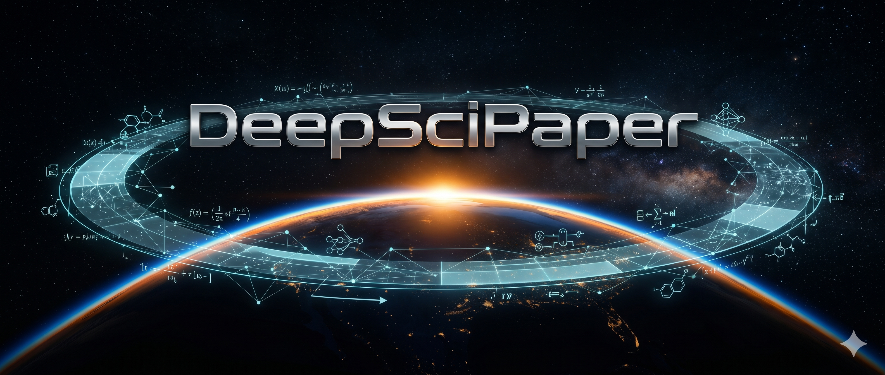
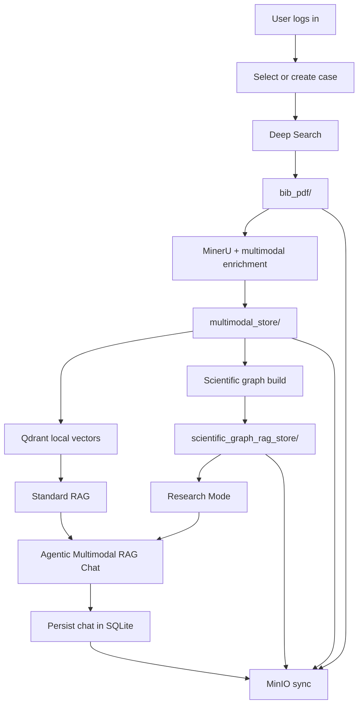
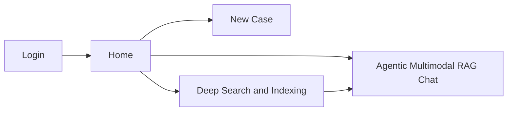
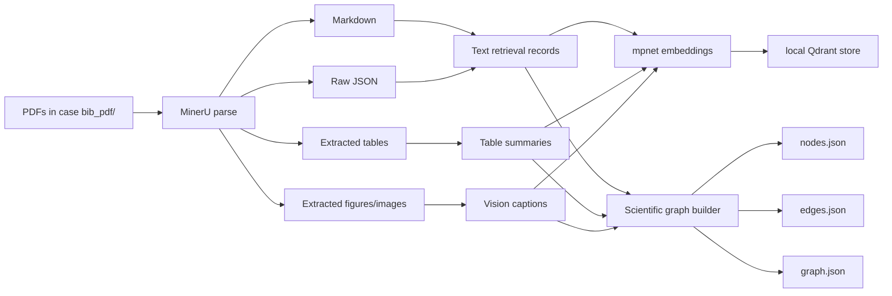
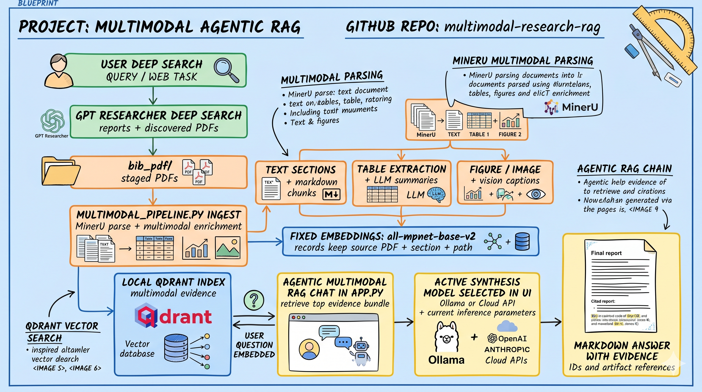
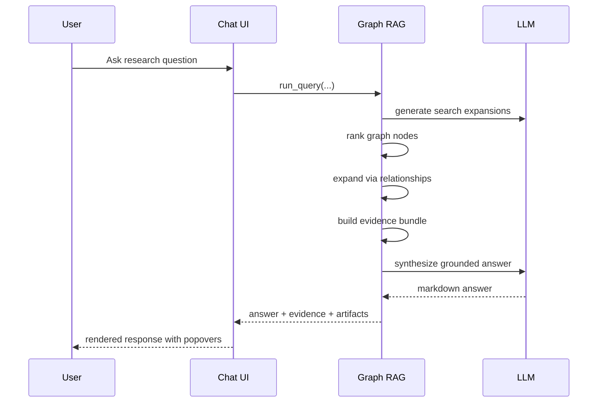

# DeepSciPaper



DeepSciPaper is a case-based scientific research copilot for students and researchers who need to discover literature, index papers locally, inspect artifacts, and discuss evidence with a grounded AI assistant.

It focuses on four workflows:

- agentic deep literature search
- multimodal PDF parsing and indexing
- Standard RAG over local Qdrant evidence
- graph-backed Research Mode for higher-rigor scientific answers

The app is built around one practical idea: every research case should be reproducible, inspectable, and portable. Each case keeps its own PDFs, multimodal store, graph store, chat history, and optional MinIO backup.

### Demo 1

<p align="center">
  
</p>

## Current Product Surface

DeepSciPaper includes:

- login screen with demo credentials
- home page with case overview
- case creation and switching
- Deep Search workspace
- Agentic Multimodal RAG Chat workspace
- SQLite-backed app state
- optional MinIO artifact sync
- automatic graph build after multimodal indexing

Default login:

- username: `admin`
- password: `admin`

## Case-Based Workspace Layout

Each case lives under:

```text
cases/<case-slug>/
├── bib_pdf/
├── multimodal_store/
└── scientific_graph_rag_store/
```

This keeps one study from contaminating another. The active case controls what Deep Search, indexing, chat, and artifact inspection work against.

## High-Level Architecture


```mermaid
flowchart TD
    A[User logs in] --> B[Select or create case]
    B --> C[Deep Search]
    C --> D[bib_pdf/]
    D --> E[MinerU + multimodal enrichment]
    E --> F[multimodal_store/]
    F --> G[Qdrant local vectors]
    F --> H[Scientific graph build]
    H --> I[scientific_graph_rag_store/]
    G --> J[Standard RAG]
    I --> K[Research Mode]
    J --> L[Agentic Multimodal RAG Chat]
    K --> L
    L --> M[Persist chat in SQLite]
    D --> N[MinIO sync]
    F --> N
    I --> N
    M --> N
```

## Application Navigation


```mermaid
flowchart LR
    A[Login] --> B[Home]
    B --> C[New Case]
    B --> D[Deep Search and Indexing]
    B --> E[Agentic Multimodal RAG Chat]
    D --> E
```

## Deep Search Workflow

The Deep Search tab is intentionally focused:

- deep search query
- report type
- research-plan generation
- plan editing
- approved research execution
- final report reading
- source explorer

The deep-search engine is local `gpt-researcher`, vendored in:

```text
engines/gpt-researcher/
```

When a search completes, the app:

1. saves the report into the active case `bib_pdf/`
2. validates discovered links
3. downloads reachable PDFs when available
4. keeps the report readable in-app
5. offers a direct path into indexing and chat

## Multimodal Indexing Workflow

The indexing controls live in the **Agentic Multimodal RAG Chat** tab because that is where users need workspace readiness.

When you click **Index**, the app performs:

1. MinerU parsing
2. multimodal artifact extraction
3. table summarization
4. figure/image captioning
5. fixed mpnet embedding creation
6. Qdrant indexing
7. automatic scientific graph creation

At the end of a successful run, the case is ready for both Standard RAG and Research Mode.

### Index-Time Artifact Flow


```mermaid
flowchart LR
    A[PDFs in case bib_pdf/] --> B[MinerU parse]
    B --> C[Markdown]
    B --> D[Raw JSON]
    B --> E[Extracted tables]
    B --> F[Extracted figures/images]
    C --> G[Text retrieval records]
    D --> G
    E --> H[Table summaries]
    F --> I[Vision captions]
    G --> J[mpnet embeddings]
    H --> J
    I --> J
    J --> K[local Qdrant store]
    G --> L[Scientific graph builder]
    H --> L
    I --> L
    L --> M[nodes.json]
    L --> N[edges.json]
    L --> O[graph.json]
```



## Two RAG Modes

The chat tab has two retrieval modes. Both render through the same modern answer surface with markdown, tables, code blocks, evidence popovers, PDF previews, and artifact references.

### Standard RAG

Standard RAG is the faster path.

It uses:

- `multimodal_store/`
- local Qdrant retrieval
- evidence bundle assembly
- synthesis with the active UI-selected model

Best for quick grounded answers, scanning evidence fast, and iterative questioning.

### Research Mode

Research Mode is the deeper path.

It uses:

- `scientific_graph_rag_store/`
- multi-query expansion
- graph node ranking
- relationship expansion
- evidence aggregation across node links
- synthesis with the active UI-selected model

Best for section-aware reasoning, table/figure/text linkage, structured scientific answers, and higher interpretability.

## How Graph RAG Works

Each indexed paper gets an independent knowledge graph.

Node types:

- paper root
- section/text node
- table node
- figure node

Each node can contain global paper context, local section context, previous/next node information, related node links, and artifact paths.

Relationships include:

- `contains`
- `next`
- `previous`
- `same_section`
- `references_table`
- `references_figure`
- `contextual_neighbor`
- `semantic_similarity`

### Graph Query Path


```mermaid
sequenceDiagram
    participant U as User
    participant C as Chat UI
    participant G as Graph RAG
    participant L as LLM

    U->>C: Ask research question
    C->>G: run_query(...)
    G->>L: generate search expansions
    G->>G: rank graph nodes
    G->>G: expand via relationships
    G->>G: build evidence bundle
    G->>L: synthesize grounded answer
    L-->>G: markdown answer
    G-->>C: answer + evidence + artifacts
    C-->>U: rendered response with popovers
```

## Evidence Display

Evidence is inspectable, not decorative.

The app supports:

- evidence popovers from chat answers
- evidence popovers from deep-search reports
- local PDF preview
- figure preview when an artifact path points to an image
- download button for the underlying PDF
- source links in the report explorer

## SQLite Persistence

SQLite stores:

- cases
- chat history
- sync history

Database default:

```text
app_state/research_copilot.db
```

## MinIO Sync

If configured, MinIO sync uploads:

- `bib_pdf/`
- `multimodal_store/`
- `scientific_graph_rag_store/`
- exported case metadata
- exported chat history

This makes a study portable beyond the local machine.

## Installation

### 1. Create environment

```bash
conda create -n research_copilot python=3.11 -y
conda activate research_copilot
```

### 2. Install Python dependencies

```bash
python -m pip install -r requirements.txt
```

### 3. Install system packages

For Debian/Ubuntu, install the PDF and image utilities commonly needed by parsing and preview workflows:

```bash
sudo apt update
sudo apt install -y poppler-utils tesseract-ocr libgl1 libglib2.0-0
```

### 4. Create your environment file

```bash
cp .env.example .env
```

## Important `.env` Settings

Core examples:

```env
OLLAMA_BASE_URL=http://localhost:11434
DEFAULT_MODEL=gemma4:26b

OPENAI_API_KEY=
DEEPSEEK_API_KEY=
TAVILY_API_KEY=

APP_DB_PATH=./app_state/research_copilot.db
SCIENTIFIC_GRAPH_RAG_STORE_DIR=./scientific_graph_rag_store

MINIO_ENDPOINT=
MINIO_ACCESS_KEY=
MINIO_SECRET_KEY=
MINIO_BUCKET=
MINIO_SECURE=false
```

## Run The App

```bash
conda run --no-capture-output -n research_copilot python -m streamlit run app.py --server.address 0.0.0.0 --server.port 8501
```

Open:

```text
http://localhost:8501
```

## Typical End-to-End Usage

### Create a new case

1. log in with `admin` / `admin`
2. go to **New Case**
3. enter case details
4. switch into the new case

### Run Deep Search

1. open **Deep Search & Multimodal Indexing**
2. write the research objective
3. generate a research plan
4. review the planned queries
5. start approved research
6. inspect the final report

### Build retrieval-ready workspace

1. open **Agentic Multimodal RAG Chat**
2. click **Index**
3. wait for multimodal store creation, Qdrant indexing, graph-store build, and chat-ready evidence artifacts
4. ask questions immediately

### Work in chat

- choose `Standard RAG` for faster answers
- choose `Research Mode` for graph-backed answers
- inspect evidence popovers
- review PDF and figure artifacts

## CLI Examples

### Clean multimodal store

```bash
python multimodal_pipeline.py clean --store ./cases/text_segmentation/multimodal_store
```

### Rebuild multimodal store

```bash
python multimodal_pipeline.py ingest \
  --pdf-dir ./cases/text_segmentation/bib_pdf \
  --store ./cases/text_segmentation/multimodal_store \
  --mineru-backend pipeline \
  --mineru-method auto \
  --mineru-lang en \
  --mineru-timeout 1800 \
  --text-model gemma4:26b \
  --image-model qwen3-vl:32b \
  --enrich-images \
  --force
```

### Rebuild graph store

```bash
python scientific_graph_rag.py build \
  --source-store ./cases/text_segmentation/multimodal_store \
  --graph-store ./cases/text_segmentation/scientific_graph_rag_store \
  --backend ollama \
  --model gemma4:26b \
  --ollama-base-url http://localhost:11434
```

### Query graph RAG directly

```bash
python scientific_graph_rag.py query \
  "Which papers provide benchmark evidence for text segmentation?" \
  --graph-store ./cases/text_segmentation/scientific_graph_rag_store \
  --backend ollama \
  --model gemma4:26b \
  --format markdown
```

## Notes On Models

- Multimodal indexing uses the configured text model for table summaries and the configured image model for figure understanding.
- Embeddings are fixed to `sentence-transformers/all-mpnet-base-v2` to avoid NaN failures observed with some Ollama embedding models.
- Standard RAG and Research Mode both honor the active generation backend selected in the UI: local Ollama or cloud OpenAI-compatible providers.

## Main Files

- [app.py](app.py)
- [multimodal_pipeline.py](multimodal_pipeline.py)
- [scientific_graph_rag.py](scientific_graph_rag.py)
- [case_management.py](case_management.py)
- [requirements.txt](requirements.txt)
- [.env.example](.env.example)

## Current State

This branch is the case-managed research workspace with login, case management, SQLite persistence, MinIO sync hooks, automatic graph build after multimodal indexing, and dual RAG chat modes. The product is focused on discovery, indexing, evidence inspection, and research chat.
