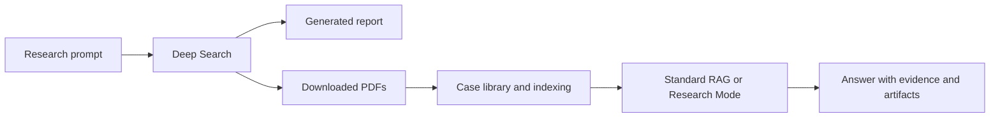

# Research Example: Image Segmentation

A saved DeepSciPaper discovery run, from the original research question to the generated report and downloaded literature.

**Start here:** [Read the research prompt](Prompt.md), then [open the generated report](deep_search_report_20261006_120502.md). Use the PDF collection below to inspect the source material yourself.

## What This Example Contains

| Artifact | Purpose |
| --- | --- |
| [Prompt.md](Prompt.md) | The original request for primary literature, datasets, benchmarks, and reproducible resources on image segmentation. |
| [Research report](deep_search_report_20261006_120502.md) | The saved model-generated synthesis from the 6 October 2026 run. |
| [PDF collection](bib_pdf/) | 14 downloaded documents available for source inspection and local indexing. |

The prompt, report and PDFs are included here. Indexes, graph stores and chat transcripts are not included; create them in your own study to explore the chat workflow.

## How To Read The Results

The report covers primary literature, benchmarks, repositories and comparative results. It is preserved as generated, **not an independently validated literature review**. In particular, it contains placeholder repository URLs under `github.com/example/`. Do not treat those links, reported metrics, or claims of state-of-the-art performance as verified evidence. Check each claim against the corresponding paper; a downloaded PDF is not automatically support for every statement in the report.

## Explore This Example In The App

1. Create a study such as **Image segmentation example**.
2. Copy the PDFs from this folder into that study's `cases/<case-slug>/bib_pdf/` directory. Keep the example originals intact.
3. Open **Agentic Multimodal RAG Chat**, then **Library and indexing**, and run **Index**. MinerU parsing, enrichment and graph construction require your configured local services.
4. Choose **Standard RAG** for retrieval over the indexed papers or **Research Mode** for graph-backed retrieval.
5. Open the answer's sources and artifacts to check the evidence.

Useful questions to try:

- Which papers evaluate segmentation rather than super-resolution, and what evidence distinguishes the tasks?
- Compare the datasets, evaluation metrics and limitations reported by the indexed studies. Cite the relevant sections.
- Which claims in the example report are supported by the downloaded papers, and which remain unverified?

## Included PDFs

Names are preserved from the download run. Numbered filenames are download identifiers, not paper titles or citation IDs.

| Document | Pages | Size |
| --- | ---: | ---: |
| [TFM_ALVARO_RUBIO_SEGOVIA.pdf](bib_pdf/TFM_ALVARO_RUBIO_SEGOVIA.pdf) | 111 | 8.3 MB |
| [TIJERC001183.pdf](bib_pdf/TIJERC001183.pdf) | 8 | 0.8 MB |
| [Tech_report_2019_panoptic_segmentation_SiemensMobility.pdf](bib_pdf/Tech_report_2019_panoptic_segmentation_SiemensMobility.pdf) | 4 | 0.3 MB |
| [VGIS_P10_fin.pdf](bib_pdf/VGIS_P10_fin.pdf) | 34 | 10.1 MB |
| [W3Paper2.pdf](bib_pdf/W3Paper2.pdf) | 14 | 0.4 MB |
| [acquired_literature_002.pdf](bib_pdf/acquired_literature_002.pdf) | 28 | 6.7 MB |
| [acquired_literature_003.pdf](bib_pdf/acquired_literature_003.pdf) | 6 | 1.6 MB |
| [acquired_literature_004.pdf](bib_pdf/acquired_literature_004.pdf) | 7 | 3.6 MB |
| [acquired_literature_005.pdf](bib_pdf/acquired_literature_005.pdf) | 6 | 1.6 MB |
| [acquired_literature_006.pdf](bib_pdf/acquired_literature_006.pdf) | 7 | 3.6 MB |
| [acquired_literature_008.pdf](bib_pdf/acquired_literature_008.pdf) | 36 | 1.6 MB |
| [acquired_literature_009.pdf](bib_pdf/acquired_literature_009.pdf) | 36 | 1.6 MB |
| [acquired_literature_011.pdf](bib_pdf/acquired_literature_011.pdf) | 8 | 0.8 MB |
| [acquired_literature_012.pdf](bib_pdf/acquired_literature_012.pdf) | 6 | 1.8 MB |

## Reproducibility

This folder is a snapshot of one run, not a guarantee that another model or a later web search will produce the same output. The original model settings and approved query plan were not saved with this example. The PDFs are intentionally included in Git; application case data, credentials, local indexes and databases remain ignored.
